# oscar64
 Optimizing small space C Compiler Assembler and Runtime for C64

## History and motivation

It is a sad fact that the 6502 used in the Commodore64 and other home computers of the 80s is widely believed to have a poor code density when it comes to compiled or wider than eight bit code.  The C standard requires computations to be made with ints which work best if they have the same size as a pointer.  

The 6502 also has a very small stack of 256 bytes which cannot be easily addressed and thus cannot be used for local variables.  Therefore a second stack for variables has to be maintained, resulting in costly indexing operations.  The 6502 is also pretty poor when it comes to indexed operations, it has no index with constant offset addressing mode, and requires the y register to be used for indexing.

Most C compilers for the 6502 thus generate large binaries when translating to native machine code.  The original idea for the **oscar64** compiler was to translate the C source to an intermediate 16 bit byte code with the option to use native machine code for crucial functions.  Using embedded assembly for runtime libraries or critical code should also be possible.

The performance of interpreted code is clearly not as good as native machine code but the penalty for 16bit code is around 40-50% and less than 10% for floating point.  Code that can use 8bit may suffer up to a factor of 10 to 20.

The goal was also to implement the C99 standard and not some subset for performance reasons.  So the compiler must support:

* Floating point
* Recursion
* Multi dimensional arrays
* Pointer to structs

After extensive optimizations it turns out, that the interpreted code is not significantly smaller than the native code in most scenarios (although there are cases where the difference is significant).  
 
 
## Limits and Errors

There are still several open areas, but most targets have been reached.  The current 
stone performance is 94 iterations per second with byte code (11696) and 395 iterations with native code (10425 Bytes).  This clearly shows that Dhrystone is not a valid benchmark for optimizing compilers, because it puts the 6502 on par with a 4MHz 8088 or 68k, which it clearly is not.

### Language

* Missing warnings for all kind of abuses

### Linker

* No external libraries

### Standard Libraries

* No standard file functions, but CBM based file ops

### Runtime

* No NaN support for floats
* Basic zero page variables not restored on stop/restore

### Intermediate code generation

* No check for running out of temporary registers

### Native code generation

### C++ support level

The compiler will most likely not support a current C++ standard in the near future, but several C++ features are already implemented.  The compiler can be switched into C++ mode with the command line option -pp or by providing a source file with a .cpp extension.

Supported Features:

* namespaces
* reference types
* member functions
* constructors and destructors
* operator overloading
* single inheritance of class and struct
* const member functions
* new, delete, new[] and delete[]
* virtual member functions
* string and iostream classes
* default parameters for class members and functions
* templates
* vector, array and list template classes
* lambda functions
* auto variables, parameters and return types
* for range loop
* constexpr compile time evaluation
* parameter packs and templates

## Installation and Usage

### Installing on windows

A windows installer is provided with the release, the compiler is installed into "%programfiles(x86)%\oscar64\bin\oscar64".  When not using batch or make files, it might be a good idea to add the folder to the path environment variable.

### Building

The compiler can also be built using MSVC or GCC.  A visual studio project and a makefile are part of the source repository. The makefile is in the make folder.

### Compiler arguments

The compiler is command line driven, and creates an executable .prg file.

    oscar64 {-i=includePath} [-o=output.prg] [-rt=runtime.c] [-tf=format] [-tm=machine] [-e] [-n] [-dSYMBOL[=value]] {source.c|source.cpp}
    
* -v : verbose output for diagnostics
* -v2 : more verbose output
* -i : additional include paths
* -o : optional output file name
* -rt : alternative runtime library, replaces the crt.c (or empty for none)
* -e : execute the result in the integrated emulator
* -ep : execute and profile the result in the integrated emulator
* -bc : create byte code for all functions
* -n : create pure native code for all functions (now default)
* -d : define a symbol (e.g. NOFLOAT or NOLONG to avoid float/long code in printf)
* -O1 or -O : default optimizations
* -O0 : disable optimizations
* -O2 : more aggressive speed optimizations including auto inline of small functions
* -O3 : aggressive optimization for speed
* -Os : optimize for size
* -Oi : enable auto inline of small functions (part of O2/O3)
* -Oa : optimize inline assembler (part of O2/O3)
* -Oz : enable auto placement of global variables in zero page (part of O3)
* -Op : optimize constant parameters
* -g : create source level debug info and add source line numbers to asm listing
* -tf : target format, may be prg, crt or bin
* -tm : target machine
* -d64 : create a d64 disk image
* -f : add a binary file to the disk image
* -fz : add a compressed binary file to the disk image
* -xz : extended zero page usage, more zero page space, but no return to basic
* -cid : cartridge type ID, used by vice emulator
* -pp : compile in C++ mode

A list of source files can be provided.

#### Supported target machines

* c64 : Commodore C64, (0x0800..0xa000)
* c128 : Commodore C128, memory range (0x1c00..0xfc00)
* c128b : Commodore C128, first 16KB only (0x1c00..0x4000)
* plus4 : Commodore PLUS4, (0x1000..0xfc00)
* vic20: Commodore VIC20, no extra memory (0x1000..0x1e00)
* vic20+3 : Commodore VIC20, 3K RAM expansion (0x0400..0x1e00)
* vic20+8 : Commodore VIC20, 8K RAM expansion (0x1200..0x4000)
* vic20+16 : Commodore VIC20, 16K RAM expansion (0x1200..0x6000)
* vic20+24 : Commodore VIC20, 24K RAM expansion (0x1200..0x8000)
* pet: Commodore PET, 8K RAM (0x0400..0x2000)
* pet16 : Commodore PET, 16K RAM (0x0400..0x4000)
* pet32 : Commodore PET, 32K RAM (0x0400..0x8000)
* nes : Nintendo entertainment system, NROM 32 K ROM, no mirror
* nes_nrom_h : Nintendo entertainment system, NROM 32 K ROM, h mirror
* nes_nrom_v : Nintendo entertainment system, NROM 32 K ROM, v mirror
* nes_mmc1 : Nintendo entertainment system, MMC1, 256K PROM, 128K CROM
* nes_mmc3 : Nintendo entertainment system, MMC3, 512K PROM, 256K CROM
* atari : Atari 8bit systems, (0x2000..0xbc00)
* x16 : Commander X16, (0x0800..0x9f00)

#### C64 Cartridge formats

Three cartridge formats are supported

* -tf=crt : creates an easyflash cartridge with common code expanded from bank 0 into memory
* -tf=crt8 : creates a generic 8KB cartridge from 0x8000-0xa000 with autostart header
* -tf=crt16 : creates a generic 16KB cartridge from 0x8000-0xc000 with autostart header
* -cid=nnn : specifies the type ID, used by vice emul

The easyflash format cartridge expands the first 16KB bank into memory to provide a
common area of "code" and "data".  This is taken from the standard code and data section in region "main".

The generic cartridge formats use the region "rom" from the first bank and include an autostart header.
The sections "code" and "data" are placed into this "rom" region. The "bss", "stack" and "heap" sections
are placed into the "main" region from 0x0800 to 0x8000.

The layout can be changed by defining own "main" and "rom" regions.

### Files generated

The main file generated by the compiler is a .prg, .crt or .bin with the code and constant data.  Additional files are created to support debugging and analysis:

#### Map file ".map"

Shows the addresses of all regions, sections and objects.  This is a good place to look, if your generated code turns out to be too large.

#### Assembler source ".asm"

A listing of the generated bytecode and native assembler instructions.  A good place to cross reference when stuck in the machine code monitor.

#### Intermediate code ".int"

A listing of the generated intermediate code.

#### Vice debugger ".lbl"

Creates vice monitor commands to define all static labels.

	al 0801 .startup
	al 164d .spentry
	al 174c .BSSStart
	al 1766 .BSSEnd
	al 9fd7 .StackEnd

One can load the label file in the monitor using the load_labels (ll) command or provide it on the command line for vice with the "-moncommands" command line argument.

#### Complete debug information ".dbj"

This is a JSON file that contains detailed debug information.

it has four top sections:

* memory : complete memory map with lables and source location
* variables : list of all global/static variables with address and type index
* functions : list of all functions with local variables, line numbers and addresses
* types : list of all types

##### Debug memory information

The memory partitioning is described using a list of

* name : name of the memory object
* start : start address (inclusive)
* end : end address (exclusive)
* type : linkage type of memory object
* source : source file that declared this memory object
* line : source line that declared this memory object

##### Debug type information

Every defined type has a unique numeric typeid that is used to reference it from the variable sections or from composite types.

Each type has up to five attributes:

* name : a string, present for all named types
* typeid : the unique numeric ID for this type
* size : size of a variable of this type in bytes
* type : base type or composition method for this type
	* int : signed Integer
	* unit : unsigned integer
	* bool : boolean value
	* enum : enumeration
	* ptr : pointer to
	* ref : reference
	* struct : struct/class
	* union
* members : list of members of a composite type or enum
* eid : typeid for pointer or reference targets

##### Debug variables information

Global variables have a name, a memory range and a typeid

* name : a string, present for named variables
* start : start address (inclusive)
* end : end address (exclusive)
* typeid : the type id for this variable

##### Debug function information

* name : a string, present for named functions
* start : start address (inclusive)
* end : end address (exclusive)
* source : source file that declared this function
* line : source line that declared this function
* lines : list of all source lines for this function
	* start : start address (inclusive)
	* end : end address (exclusive)
	* source : source file that declared this function
	* line : source line that declared this function
* variables : list of all local variables for this function
	* name : a string, present for named variables
	* start : start address (inclusive)
	* end : end address (exclusive)
	* enter : first line where the vaiable becomes visible
	* leave : last line where the variable is visible
	* typeid : the type id for this variable
	* base : zero page register pair for (sp/fp) for stack based variables

### Creating a d64 disk file

The compiler can create a .d64 disk file, that includes the compiled .prg file as the first file in the directory and a series of additional resource files.  The name of the disk file is provided with the -d64 command line options, additional files with the -f or -fz option.

	oscar64 charsetload.c -d64=charsetload.d64 -fz=../resources/charset.bin
	
The compressed files can be loaded into memory and decompressed using the oscar_expand_lzo function from oscar.h or on the fly while reading from disk with the krnio_read_lzo function.

### Building the samples

The windows installer puts the samples into the users documents folder, using the directory "%userprofile%\documents\oscar64\samples".  A batch file *make.bat* is also placed into this directory which invokes the compiler and builds all samples.  It invokes a second batch file in "%userprofile%\documents\oscar64\bin\oscar64.bat" that calls the compiler.

On a linux installation one can build the samples invoking the *build.sh* shell script in the samples directory, for multithreading use *make -C samples -j*.

### Debugging

The .asm file is a great resource when debugging from within e.g. the VICE monitor, but there is also a source level debugging project underway: [Modern VICE PDB Monitor](https://github.com/MihaMarkic/modern-vice-pdb-monitor) by MihaMarkic.  The compiler options for a good source level debugging experience should be "-n -g -O0" to generate native code with debugging symbols and no (well less) optimization.

## Language extensions

The compiler has various extensions to simplify developing for the C64.

### Embedding binary data

The compiler supports the #embed preprocessor directive to import binary data.  It converts a section of an external binary file into a sequence of numbers that can be placed into an initializer of an array.

	byte data[] = {
	
		#embed "data.bin"
		
	};

A section of the file can be selected by providing a limit and or an offset into the file before the file name.

	byte data[] = {
	
		#embed 4096 126 "data.bin"
		
	};

Embedded data can be compressed during compile time and expanded at runtime using one of the expand functions in the oscar.h 

	char charset[] = {
		#embed 2048 0 lzo "../resources/charset.bin"
	};
	

	int main(void) {
		oscar_expand_lzo(Charset, charset);
	}

Compression algorithms so far are LZ (lzo) and run length (rle).

### Embedding sprite and graphics data

The #embed preprocessor can also import components from spritepad and charpad files (.spd version 5 and .ctm version 8).

The component to extract (e.g. chars or tiles) is added as a further specifier.

	const char FloorChars[] = {
		#embed ctm_chars lzo "floortiles.ctm"
	};

Imports the character data and compresses it using lzo compression.

	const char CardsTiles[] = {
		#embed ctm_tiles8 "cards.ctm"
	};

Imports the tiles in 8 bit form and builds byte constants

	const unsigned CardsTiles[] = {
		#embed ctm_tiles16 word "cards.ctm"
	};

Imports the tiles in 16 bit form and builds word constants

	const char CardsMap[] = {
		#embed ctm_map8 "cards.ctm"
	};

Imports the map (screen) in 8 bit form and builds byte constants

	const unsigned	CardsMap[] = {
		#embed ctm_map16 word "cards.ctm"
	};

Imports the map (screen) in 16 bit form and builds word constants

	const char CardsAttrib1[] = {
		#embed ctm_attr1 "cards.ctm"
	};

	const char CardsAttrib2[] = {
		#embed ctm_attr2 "cards.ctm"
	};

Imports the attribute data

	const char SpriteData[] = {
		#embed spd_sprites lzo "sprites.spd"
	};

Imports the sprite data and compresses it using lzo compression

### Console input and output

The C64 does not use ASCII it uses a derivative called PETSCII.  There are two fonts, one with uppercase and one with uppercase and lowercase characters.  It also used CR (13) as line terminator instead of LF (10).  The stdio and conio libraries can perform translations.

The translation mode is selected in conio with the variable "giocharmap" and the function "iocharmap" which will also switch the font.

	iocharmap(IOCHM_PETSCII_2);
	printf("Hello World\n");
	
Will switch to the lowercase PETSCII font and translate the strings while printing.

PETSCII string literals can also be generated using a "p" or "P" prefix such as:

	printf(p"Hello World\n");
	
Screen codes can be generated similar using "s" or "S" prefix.

Input from the console will also be translated accordingly.

The character map for string and char constants can be changed with a pragma to match a custom character set or PETSCII.

    #pragma charmap(char, code [,count])

### Additional Optimizer information using __assume()

The compiler can be provided with additional information using the built in function __assume(cond).  This can be useful to mark unreachable code using __assume(false) for e.g. the default of a switch statement.  Another good option is to limit the value range of arguments to allow the compiler using byte operations without the need for integer promotion.

### Function level optimizer settings

	#pragma optimize(option {,option})
	
Set optimizer options that are active for the functions after it

* push : put current options on a stack
* pop : get options back from stack
* asm : allow optimization of assembler code
* noasm : prevent optimization of assembler code
* size : optimize for size
* speed : optimize for speed
* noinline : no inlinening in any case
* inline : inline if requesed with inline storage attribute
* autoinline : auto inline of small or only once used functions
* maxinline : inline any function suitable
* constparams : enable constant parameter folding into called functions
* noconstparams : disable constant parameter folding into called functions
* 0 : no optimization
* 1 : default optimizations
* 2 : aggressive optimizations
* 3 : even more aggressive optimizations

### Loop unrolling

Loop unrolling on 6502 is hard to decide for the compiler.  Memory is usually scarce, so it only does it in really obvious cases (and in less obvious cases for O3).  On the other hand unrolling is required to get good performance in e.g. scrolling code.  Therefore the compiler offers an unrolling pragma, that can be used to specify the amount of unrolling either as a number or "full" for complete.

The following code scrolls the screen to the left, and completely unrolls the inner vertical loop.

	for(char x=0; x<39; x++)
	{
		#pragma unroll(full)
		for(char y=0; y<25; y++)
			screen[y][x] = screen[y][x + 1];
	}

Sometimes it is better to unroll the loop not in the order it normally executes, but using page size chunks.  When e.g. filling a C64 screen with a loop:

	for(int i=0; i<1000; i++)
		Screen[i] = ' ';
		
Unrolling this loop would not help, the index would still not fit into the 8 bit x or y register.  Using a page level unroll, the compiler will unroll the loop into four stores, each 250 bytes apart, and use the y or x register for indexing:

	#pragma unroll(page)
	for(int i=0; i<1000; i++)
		Screen[i] = ' ';

	0921 LDY #$00
	0923 LDA #$20
	0925 STA $0400,y 
	0928 STA $04fa,y 
	092b STA $05f4,y 
	092e STA $06ee,y 
	0931 INY
	0932 CPY #$fa
	0934 BCC $0925

### Striped arrays

The 6502 has no real address registers for indirect/offset addressing and no native multiply instruction.  Accessing array elements of structs or integers is thus more expensive than on most other processors.  The index registers and the byte structure of the processor work nice with arrays of byte that are up to 256 elements in size.  An array of structs (or 16 bit integers/pointers) could thus be split into individual arrays of bytes for each element, allowing fast access using the index registers.  Oscar supports this layout with the __striped storage qualifier.

	int array[8];
	
The memory layout of this array will be

	LHLHLHLHLHLHLHLH
	
so the compiler has to multiply the index by two to access each element.  A striped layout

	__striped int array[8];
	
will result in this memory structure:

	LLLLLLLLHHHHHHHH
	
so the compiler can use absolute with index to access each element. 

Similar for a struct:

	struct A {char x; char y; char z} a[5];
	
	xyzxyzxyzxyzxyz
	
	__striped struct A {char x; char y; char z} a[5];
	
	xxxxxyyyyyzzzzz
	
The downside of this layout is the inability to have a native pointer to reference one of the elements.  The pointer would have to know the memory layout of the array.  Oscar borrows the "auto" keyword from C++ to enable some of this functionality:
		
	auto pa = a + 4;
	pa-> x = 1;
	
This feature is still experimental and only a benefit, if the array has not more than 256 elements.

### Marking functions as native

Routines can be marked to be compiled to 6502 machine code with the native pragma:

    void Plot(int x, int y)
    {
        (*Bitmap)[y >> 3][x >> 3][y & 7] |= 0x80 >> (x & 7);
    }

    #pragma native(Plot)

Or alternatively with a __native storage class specifier

    __native void Plot(int x, int y)
    {
        (*Bitmap)[y >> 3][x >> 3][y & 7] |= 0x80 >> (x & 7);
    }
	
### Usage of zero page

The compiler uses basic zero page space for temporaries, local variables and function arguments.  Global and static variables are allocated in the data and bss segment in normal memory.  The __zeropage storage class specifier can be applied to global variables and will be allocated in the zero page segment (usually 0x80 to 0xff).  This is only useful when the kernal is not used.  Zero page allocated global variables are not initialized.

    __zeropage int a;

### Prevent inlining

With compiler option O2 and greater the compiler will try to inline small functions.  This may not always be desirable, so the __noinline qualifier can be added to a function to prevent this.

    __noinline byte EzRead(char bank, const char * p)
	{
		eflash.bank = bank;
		byte b = *p;
		eflash.bank = CodeBank;
		return b;
	}

### Pre-Processor control

The pre processor has additional commands to control the scanner and allow for dynamic code generation including loops.

Assign a computed value to a pre processor macro

	#assign <name> <expression>
	
Loop source code 
	
	#repeat
	...
	#until <condition>
	
This sample fills a single screen column with a given color, by generating 25 assigns to absolute addresses.
	
	void color_column(char cx, char color)
	{
	#assign ry 0
	#repeat		
		Color1[40 * ry + cx] = color;
	#assign ry ry + 1
	#until ry == 25
	#undef ry
	}
	
This sample initially assigns the value 0 to the pre processor macro ry and increments it each time the loop body is replicated.  The loop generates 25 copies of the body, each with a different value for ry.

A simpler loop with only a single line template expansion is provided with the #for(iterator, count) preprocessor command:

	char * const ScreenRows2[] = {
	#for(i,SCREEN_HEIGHT) Screen + SCREEN_WIDTH * i,
	};

	
### Linker control

The linker includes only objects that are referenced, starting by the startup code into main() and so on.

If you need to have a function or variable present regardless, you can specify it with the __export storage class specifier or use the #pragma reference(name) pragma.

#### Using libraries

The compiler does a full program compile, the linker step is part of the compilation.  It knows all functions during the compilation run and includes only reachable code in the output.  Source files are added to the build with the help of a pragma:
        
    #pragma compile("stdio.c")

This way you do not need a makefile to build your project.  All header files of the provided libraries add their implementation to the build using this pragma.

#### Placement

The linker uses three levels of objects:

* Region : A physical region of memory or a bank in a cartridge
* Section : A logical region of memory, may span several sections
* Object : Generated code or data, either initialized or empty (e.g. stack or bss)

With the default prg target and no further changes, the compiler creates the following regions and sections:

* "startup" : **0x0801-0x0900** Basic and assembler startup code and interpreter loop
	* "startup"
* "bytecode" : **0x0900-0x0a00** Interpreter jump table if not all native
	* "bytecode"
* "main": **0x0a00-0xa000** Main region for code, data, bss, heap and stack
	* "code"	: Compiled code
	* "data" : Constant data
	* "bss" : Non constant data, initialized to zero on program start
	* "heap" : Memory available for allocation
	* "stack" : Data stack
	
The layout can be changed using #pragma commands.  One may e.g. use all memory up to 0xd000 with the following code:

	#include <c64/memmap.h>

	#pragma region( main, 0x0a00, 0xd000, , , {code, data, bss, heap, stack} )

	int main(void)
	{
		mmap_set(MMAP_NO_BASIC)

Regions can also be used to place assets such as character sets at fixed location in the prg file to avoid copying:

	#pragma region( lower, 0x0a00, 0x2000, , , {code, data} )

	#pragma section( charset, 0)

	#pragma region( charset, 0x2000, 0x2800, , , {charset} )

	#pragma region( main, 0x2800, 0xa000, , , {code, data, bss, heap, stack} )

	#pragma data(charset)

	char charset[2048] = {
		#embed "../resources/charset.bin"
	}

	#pragma data(data)

The #pragma data(), #pragma code() and #pragma bss() control the placement of the generated objects into sections other than the default sections.

#### Heap and Stack sections

The heap and stack sections have an initial size of 1K and 4K.  The heap will grow to use all space between the end of the data/bss section and
the start of the stack section.  The size of the stack and the minimum size of the heap can be specified using pragmas:

	#pragma stacksize( 4096 )
	
	#pragma heapsize( 4096 )

The linker will throw an error if the heap or stack cannot be placed without collision.

The __bankof operator returns the bank id of a function or constant placed into a ROM bank.

#### Overlays

The linker can generate overlay files that are stored as .prg in the .d64 when selected as target.

The mechanism uses the cartridge bank to denote up to 64 overlays.  Each bank can be associated with one overlay file, which will then contain the used content of this bank.

	#pragma overlay( ovl1, 1 )
	
The overlay file can then be loaded in memory during program execution:

	krnio_setnam(P"OVL1");
	krnio_load(1, 8, 1);

#### NES ROM Banks

With NROM mappers, the prg and chr code is put into cartridge bank zero.

	#pragma section( tiles, 0 )
	
	#pragma region( tbank, 0x0000, 0x2000, , 0, { tiles } )

	#pragma data(tiles)

	__export char tiles[] = {
		#embed "nesmini.chr"
	};

	#pragma data(data)

The 32KByte of prg code starts at 0x8000 and goes upto 0xff80.  A startup section from 0xff80 to 0xfff9 is taken from the crt.c.

A six byte boot section is placed from 0xfffa to 0xffff in all modes, which has to be populated by the game code with the appropriate pointers.

	#pragma data(boot)

	__export struct Boot
	{
		void * nmi, * reset, * irq;
	}	boot = {
		nmi,
		(void *)0xff80,
		nullptr
	};

	#pragma data(data)

Rom mappers MMC1 and MMC3 share the last rom bank from 0xc000 to 0xffff including the boot section.  This is bank 15 in MMC1 and bank 31 in MMC3.

The pageable ROM is assumed to be 0x8000 to 0xbfff in all banks from zero up.

	#pragma section( code0, 0 )
	#pragma region( code0, 0x8000, 0xc000, , 0, { code0 } )

And for bank one

	#pragma section( code1, 0 )
	#pragma region( code1, 0x8000, 0xc000, , 1, { code1 } )

### Inline Assembler

Inline assembler can be embedded inside of any functions, regardless of their compilation target of byte code or native.  

#### Accessing variables in assembler

Access to local variables and parameters is done with zero page registers, global variables are accessed using absolute addressing.

    void putchar(char c)
    {
        __asm {
            lda c
            bne w1
            lda #13
        w1:
            jsr 0xffd2
        }
    }

A function return value can be provided in the zero page addresses ACCU (+0..+3).

    char getchar(void)
    {
        __asm {
            jsr 0xffcf
            sta accu
            lda #0
            sta accu + 1
            }
    }

Labels are defined with a colon after the name.  Pure assembler functions can be defined outside of the scope of a function and accessed using their name inside of other assembler function.  One can e.g. set up an interrupt

### Interrupt routines

The compiler provides two levels of interrupt safe functions.  The specifier __interrupt caues all zero page registers used by the function to be saved, the __hwinterrupt also saves the CPU registers and exits the function with rti

	#include <c64/memmap.h>
	#include <c64/cia.h>
	#include <c64/vic.h>

	__hwinterrupt void irq(void)
	{
		vic.color_border++;

		// some interrupt code

		vic.color_border--;
		vic.intr_ctrl <<= 1;	
	}

	int main(void)
	{
		__asm { sei }   // Disable interrupt
		mmap_set(MMAP_NO_ROM);	// Disable kernal rom
		cia_init();		// No more CIA interrupts
		
		*(void **)0xfffe = irq;     // Install interrupt routine
		vic.intr_enable = VIC_INTR_RST;	// Init raster interrupt
		vic.ctrl1 &= ~VIC_CTRL1_RST8;
		vic.raster = 100;
		
		__asm { cli }   // Re-enable interrupt
		
		for(;;)
		{
			// Non interrupt code
		}

		return 0
	}
	
## Samples

### Character input and output "stdio"

#### helloworld.c

### Disk file access "kernalio"

The C64 uses various kernal routines to read and write files on disk.  These routines are available with a library <c64/kernalio.h>  All samples in this directory use drive 9, but can easily be changed to drive 8.

#### Reading the directory "diskdir.c"

Reads the directory from the current disk in drive 9 and displays it on screen.

#### Writing characters "charwrite.c"

Opens a ".prg" file on drive 9 for writing and writes 128 characters into the file.

#### Reading characters "charread.c"

Opens a ".prg" file on drive 9 for reading, reads all characters from the file and prints there character code on screen.

#### Writing binary data "filewrite.c"

Opens a ".prg" file on drive 9 for writing and writes an array of structs as binary data into the file.

#### Reading binary data "fileread.c"

Opens a ".prg" file on drive 9 for reading and reads an array of structs as binary data into the file.

#### Writing image data "hireswrite.c"

Renders a hires image into a buffer at 0xe000..0xff40 and saves it to disk.  The added complexity is, that the kernal itself cannot access the memory in this region because it is covered by the kernal ROM itself.  The operation is therefore implemented using a 200 byte RAM buffer.

#### Reading image data "hiresread.c"

Reads a hires image from disk into a buffer at 0xe000..0xff40 and displays it.  The read can be performed without a secondary buffer, because writes to the ROM end up in the RAM underneath.

### Remapping memory "memmap"

The C64 memory map is very flexible.  These samples show how to manipulate the memory map and use easyflash ROMs to execute larger programs.

#### Using more memory "largemem.c"

Moves the BASIC ROM out of the way and allows the use of memory from 0x0800..0xcfff for the compiled C program.

#### Using all memory "allmem.c"

Moves the BASIC ROM, Kernal ROM and the IO area out of the way and allows the use of memory from 0x0800 to 0xfff0 for the compiled C code.  An interrupt trampoline is installed to keep the kernal going.

#### Custom character set "charsetlo.c"

Embeds a custom character set into the prg file at 0x2000..0x27ff and switches the character set base address in the VIC to this address.  The code and data portion of the compiled program is split into two areas to make room for this fixed location data.

#### Himem character set "charsethi.c"

Embeds a custom character set into the prg file at 0xc800..0xcfff and switches the character set base address in the VIC to this address.
  
#### Copy character set "charsetcopy.c"

Embeds a custom character set into the prg file at 0xc000..0xc7ff and copies it to 0xd000 on startup.  This frees this area for stack and heap usage.

#### Copy character set "charsetexpand.c"

Embeds a custom character set into the prg file at 0xc000..0xc7ff using lz compression and expands it to 0xd000 on startup.  This frees this area for stack and heap usage.

#### Custom character set "charsetload.c"

Builds a .d64 image containing the compiled .prg and the compressed character set.  The program reads the character set at runtime from disk.

#### Easyflash banking "easyflash.c"

When compiling for easyflash, the linker will place the code and data section into bank 0 and copy it to 0x0900..0x7fff at startup.  The remaining banks are free to be used for data or additional codes and can be banked in as needed.  This sample uses banks one to six for additional functions.

#### Easyflash common area "easyflashshared.c"

This sample reserves a fixed area of several banks for a common code segment.  A multiplexer function is placed into this common segment to select a different bank and call a function in that bank.

#### Easyflash relocated area "easyflashreloc.c"

An alternative to calling the function in the cartridge ROM itself is to copy it to a different location in RAM and execute it there.  This sample creates functions in different ROM banks that are linked for a memory area in RAM at 0x7000.  The code is copied from the ROM to RAM and then executed.

#### Easyflash low memory usage "easyflash.c"

This sample will use the memory area starting from 0x0400 for the main code section when copying the code, using the stack page 0x100 for the startup itself, thus wasting small amount of RAM space.

#### Dynamic overlays "overlay.c"

When compiling for .d64 format, the linker will place code and data sections from virtual cartridge banks into overlay files.  These files can be loaded when needed and called using normal function calls.

#### Terminate stay resident "tsr.c"

A common usage for the RAM area in 0xc000..0xcfff which is visible but not usable from BASIC is to install a terminate stay resident BASIC extension, which can then be called using sys 49152.

It would be a waste of disk space and load time to load this directly into 0xc000 together with a BASIC start code at 0x0800.  This sample uses the linker to link the code for the TSR at 0xc000 but place it into the prg at 0x0900.  The startup then copies this code to 0xc000.

### Hires graphics "hires"

The C64 has a hires graphics mode with 320x200 pixels.  Oscar provides a library <gfx/bitmap.h> for rendering in on screen and off screen bitmaps.

#### Draw lines "lines.c"

Draws and clears lines with various patterns.

#### Draw lines "fractaltree.c"

Draws a recursive fractal tree.

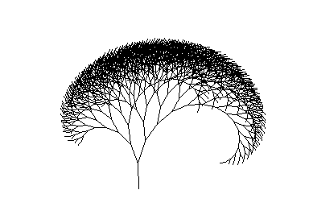

#### Draw 3D wireframe "cube3d.c"

Draws a rotating 3D wireframe cube using draw (OR) and clear (AND) operations.  The 3D operations are performed using 12.4 bit fixpoint math.

#### Software bit blit engine "bitblit.c"

Demonstrates the various bit blit modes of the software blit engine, including mask and pattern.

#### Draw polygons "polygon.c"

Draws a series of pattern filled stars with changing orientation and size.

#### Mixed text and hires screen "splitscreen.c"

Uses the <c64/rasterirq.h> library to split the screen into an upper hires and lower text mode screen.  The text area is used to query the user for x, y and radius of circles to draw.

#### 3D Function plotter "func3d.c"

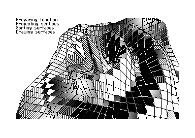

Draws a 3D function using flat shading and the painters algorithm.  All 3D operations are performed with floating point numbers using the vector library <gfx/vector3d.h>.

### Multicolor bitmaps "hiresmc"

The C64 bitmap graphics mode can also use 2bit per pixel, resulting in an image of 160x200 with four colors.  The oscar library <gfx/bitmapmc.h> implements various drawing operations in this mode.  All x coordinates still range from 0 to 320 to keep a quasi square pixel layout.

#### Draw polygons "polygon.c"

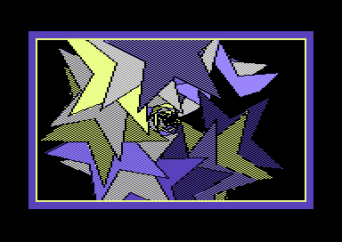

Similar to its hires counterpart but using different colors and patterns.

#### Fill similar colored areas "floodfill.c"

Draws filled random circles and fills the space using flood fill.

#### Painting with mouse or joystick "paint.c"

Paint on the screen with mouse or joystick.  Keyboard 0..9 for color selection, HOME to clear the screen.

#### 3D Function plotter "func3d.c"

Similar to its hires counterpart but using four shades of grey.

### Particle systems "particles"

Active hires graphics using particle system

#### Hires fireworks "fireworks_hires.c"

Simple hires particle system using velocity and gravity integration.

#### Multicolor fireworks "fireworks_ptr.c"

Simple multi color hires particle system using velocity and gravity integration.

#### Fireworks with striped memory layout "fireworks_stripe.c"

Simple multi color hires particle system using velocity and gravity integration.  This version uses striped memory layout for the particles to simplify addressing for the CPU.

### Mandelbrot renderer "fractals"

Various versions of the mandelbrot set using float arithmetic.

#### Text mode fractal "mbtext.c"

Simple mandelbrot renderer using text cells and colors to generate a 40x25 pixel image.

#### Hires fractal "mbhires.c"

Hires version using black and white to show the mandelbrot set.

#### Multi color fractal "mbmulti.c"

Multi color version using pure and mixed colors.

#### 3D shaded fractal "mbmulti3d.c"

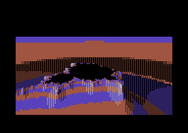

Mandelbrot rendered in 3D with shading.  The image is drawn in columns from back to front, using two adjacent columns to calculate slope and brightness.

#### Interactive Navigate a fractal "mbzoom.c"

Navigate using WASD and zoom using + and -.

### Raster beam interrupts "rasterirq"

Interrupts based on the raster beam are an important part of the C64 programmers toolbox.  Switching VIC registers on specific lines opens up many additional features, such a more sprites using multiplexing, combining modes or changing colors or scroll offsets.  The <c64/rasterirq.h> library provides easy access to this feature using on the fly code generation.

#### Static color changes "colorbars.c"

Changes the background and border colors several times per frame, creating horizontal color bars.

#### Crawling text at bottom "textcrawler.c"

Draws a scrolling line of text at the bottom of the screen.

#### Crawling text at bottom in IRQ "autocrawler.c"

Draws a scrolling line of text at the bottom of the screen, using an interrupt to update the text.

#### Chasing bars "movingbars.c"

Changing the background and border color at varying vertical positions giving the impression of two chasing colored bars.

#### Freedom for sprites "openborders.c"

Open the vertical screen borders by switching the vertical size bit at the appropriate raster lines.  The opened area is available for sprites only.

### Expand the screen "scrolling"

Scrolling is an important component of many games and editors, it extends the limited real estate of the screen to provide a small view to a larger world or document.  Pixel accurate scrolling is an important feature of the C64's VIC chip.

#### Large scrolling text "bigfont.c"

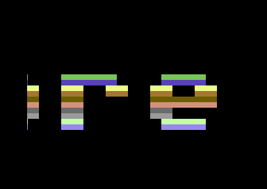

Expands a text to gigantic size, each pixel covering 2x2 character cells and scrolling from right to left.

#### Fly through tunnel "tunnel.c"

Scroll a dynamic generated tunnel with variable speed.

#### Scroll text and color "colorram.c"

Scrolls the screen text buffer and color buffer horizontally at the same time with one pixel per frame and no double buffering, relying on exact raster timing.

#### X/Y colored tile scrolling "cgrid8way.c"

Expands coloured 4x4 character tiles and scrolls vertically and horizontally at two pixel per frame without double buffering.

#### Free full speed tile expansion "grid2d.c"

Expands a 2D 4x4 tile grid at any scroll speed.  Uses a raster IRQ to limit the scrolled area.

### Moving image blocks "sprites"

Sprites are independent image blocks, such as players, missiles or enemies that can be shown on top of the background.

#### Control a sprite with a joystick "joycontrol.c"

Combines reading the joystick with the <c64/joystick.h> library and sprite movement with the <c64/sprites.h> library.

#### Use raster IRQ to show 16 sprites "multiplexer.c"

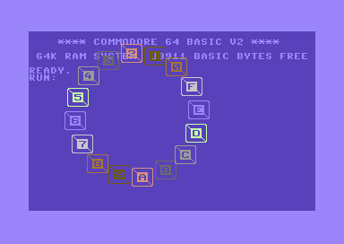

Shows 16 virtual sprites multiplexed from the physical eight sprites with raster interrupts, using the oscar sprite multiplexer library.

#### Use raster IRQ to show 32 sprites "sprmux32.c"

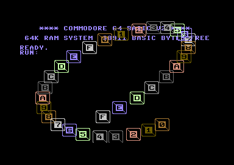

Shows 32 virtual sprites multiplexed from the physical eight sprites with raster interrupts, using the oscar sprite multiplexer library. This sample requires command line defines to increase the default number of multiplexed sprites and raster interrupt slots:

	oscar64 -n sprmux32.c -O2 -dVSPRITES_MAX=32 -dNUM_IRQS=28

#### Use raster IRQ to show 64 sprites "sprmux64.c"

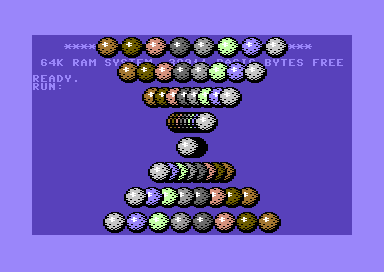

Shows 64 moving sprites using raster interrupts to update the position of the eight physical sprites every 25 screen lines.

#### Fill the screen with sprites "creditroll.c"

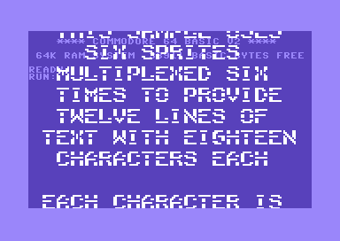

Uses sprite multiplexing and dynamic character to sprite copying to create a vertical scrolling text on top of any image or potentially moving background.

### What you came for "games"

The C64 games define much of the 8 bit area and oscar64 is intended as a of a proof that one can write great 8 bit games using C.

#### Don't bite your end "snake.c"

One of the least complex computer game and more iconic for the smartphone area.  Does not need sprites, scrolling or custom graphics.

#### The eagle has landed "lander.c"

Controlling a sprite using floating point physics and checking for collision with the background.

#### No way out "maze3d.c"

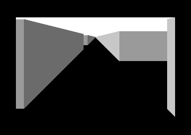

A double buffered 3D maze rendering using intermediate positions for forward movement, and simulated rotation using scrolling.

#### This one has balls "breakout.c"

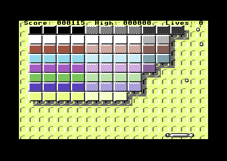

Simplified ball physics using fixed point math. More complex collision checks with the blocks to determine the edge and thus reflection.

#### Too smart for me "connectfour.c"

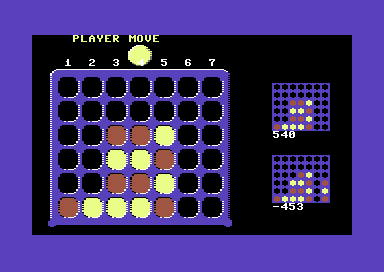

Simple turn based strategy game using tree search with alpha-beta pruning and an opening library to determine the computer moves.

#### Defend your city "missile.c"

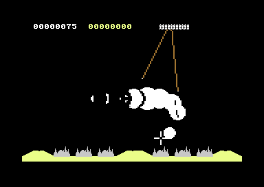

Classic computer game using the multicolor hires mode for circles and lines.  The user sprite is controlled in an interrupt routine to cover up the multi frame variable rendering.

#### Fast scroller "hscrollshmup.c"

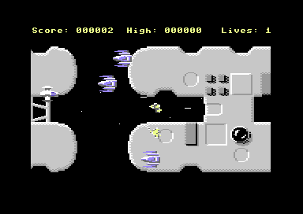

Fast horizontal scrolling shoot 'em up.  The scroll code expands a 4x4 tile grid of chars in less than a frame time, so the scroll speed is "unlimited".  A parallax level of stars in the background is implemented using an adapted star character.

The shots usd dynamic created characters to overlay on the background.

## Implementation Details

### The bytecode interpreter

The byte code interpreter is compiled by the compiler itself and placed in the source file "crt.c".  Functions implementing byte codes are marked with a pragma:

    #pragma bytecode(BC_CONST_P8, inp_const_p8)

The functions are written in 6502 assembly with the __asm keyword

    __asm inp_const_p8
    {
		lda (ip), y
		tax
		iny
		lda (ip), y
		sta $00, x
		lda #0
		sta $01, x
		iny
		jmp startup.exec
    }

The current byte code program counter is (ip),y. The compiler and interpreter loop guarantees that y is always <= 240 and can thus be used to index the additional byte code arguments without the need to check the 16 bit pointer.  The interpreter loop itself is quite compact and takes 19 cycles (including the final jump of the byte code function itself).  Moving it to zero page would reduce this by another two cycles but is most likely not worth the waste of temporary space.

    exec:
        lda (ip), y
        sta execjmp + 1
        iny     
    execjmp:
        jmp     (0x0900)

Only JMP/BRANCH and NOP bytecodes check for the y register to exceed it's allowed range of 0..240.  The compiler ensures that there are no linear code sequences longer than 240 bytes by inserting NOP bytecodes at appropriate distances.

### Zero page usage

The intermediate code generator assumes a large number of registers so the zero page is used for this purpose.  The allocation is not yet final (and can be changed using pragmas):

* **0x02-0x02** spilling of y register
* **0x03-0x0c** workspace for mul/div and floating point routines
* **0x0d-0x1a** function arguments for leaf functions
* **0x19-0x1a** instruction pointer
* **0x1b-0x1e** integer and floating point accumulator
* **0x1f-0x22** pointers for indirect addressing
* **0x23-0x24** stack pointer
* **0x25-0x26** frame pointer
* **0x43-0x52** caller saved registers
* **0x53-0x8f** callee saved registers

### Compiler Stages

The compiler uses most of the traditional stages:

#### Scanner/Pre-Processor

The scanner and pre processor phases are interleaved (causing subtle incompatibilites with C) but allowing additional features such as loop expansion.

#### Parser

The parser uses an extended recursive descent algorithm and uses already parsed information to control the parsing.  It greates a graph built of "Declaration" objects.  It performs basic constant folding and limited type checking.  

#### Global Analyzer

The global analyzer looks at the functions of all compilation modules and decides the calling convention and inlining for all functions.

#### Intermediate Code Generator

The intermediate code generator takes the declaration graph and converts it into intermediate code and linker data objects. This step also performs the final type checks and additional constant folding.  Inlining is also performed in this step.

#### Intermediate Code Optimizer

The intermediate code optimizer works on the intermediate code to perform machine agnostic optimizations, such as value forwarding, strength reduction or loop unrolling.  It also tries to build evaluation trains to reduce the amount of temporaries required for execution.

#### Native/Bytecode Generator

Translates the intermediate code into symbolic bytecode or 6502 assembler instructions.  The code generator looks at several instructions at the same time to pick good native instructions.

#### Native/Bytecode Optimizer

The symbolic assembler code is then further optimized using a specialized optimizer.

#### Native/Bytecode Assembler

This stage translates the symbolic assembler / bytecode into binary and makes it available for the linker.  It also claculates the optimal placement of the basic block to take advantage of the single byte branch offsets.

#### Linker

The linker determines all objects that are referenced and discards objects that are not.  It then places the objects into their sections and spreads the sections over the regions.  Then all references between the objects are resolved.  Finally the prg or crt file is written.

#### Listing generator

The final step is generating various listing files to support debugging.

### Optimizations performed

Besides simple constant folding, optimizations are performed at three stages.   

* Inlining during intermediate code generation.I
* Transforming the intermediate code
* Transforming the native/bytecode

#### Intermediate code optimizations

##### Value numbering and forwarding

This step determines duplicate evaluation of the same expression and forwards the result of the first to the second, thus eliminating the duplicate.  Duplicate expressions are frequently the result of array indexing.  This also covers common subrexpression evaluation.

##### Strength reduction

Multiplications and divisions are replaced with shift and/or adds if possible.  E.g. indexing in loops using the index variable may end up with a pointer that is incremented each iteration.

##### Loop Invariants

Expressions that do not change during the execution of a loop are pushed out of the loop and into the block before the loop.

##### Loop unrolling

Simple loops with a fixed number of iterations may be unrolled into a contiguous code sequence.

##### Dead Code Elimination

Instructions that are not executed, or do not contribute to the visible state of the program executed are eliminated.  E.g. assigning a value to a variable that is later not used is removed.

##### Basic Block Merge/Split

Basic blocks are merged and or split to generate longer unbroken linear code sequences.  This e.g. moves the condition of a while loop to the end of the loop and adds an additional condition at the start.

##### Load/Store forwarding

Performs Load-Load and Store-Load forwarding for memory regions that are known to be non aliased.  This also opens new opportunities for constant folding and common sub expression evaluation.  This may also completely eliminate some stores.

##### Integer Range Analysis

The possible value ranges of all integer instructions is analyzed and used to predict results of conditional instructions.  Conditional instructions provide additional bounds for value ranges.  This becomes important during native code generation to simplify 16bit code to 8bit.

The compiler can deduce from the operations performed and the loop boundaries, that the index i can never be outside of the interval 0..10

	char sum(void)
	{
		char s = 0;
		for(int i=0; i<10; i++)
			s += a[i];
		return s;
	}
	
The 16bit integer loop variable is replaced with an 8 bit register.

	sum:
		0927 LDY #$00
		0929 LDA #$00
		092b CLC
		092c ADC $0972,y ; (a + 0)
		092f INY
		0930 CPY #$04
		0932 BCC $092b
		0934 STA ACCU + 0
		0936 RTS

##### Single Branch Expressions

Expressions that are only needed in a single branch of control flow are moved onto this branch.

The sum of the array elements is only needed when the condition is false:

	char test(bool b)
	{
		char	x = a[0] + a[1];
		if (b) x = 1;
		return x;
	}

In this case, the evaluation of the sum is moved into an artificial else case:

	test:
		090e LDA P0
		0910 BNE $091c
		0912 LDA $0923 ; (a + 1)
		0915 CLC
		0916 ADC $0922 ; (a + 0)
		0919 JMP $091e ; (test + 16)
		091c LDA #$01
		091e STA ACCU + 0
		0920 RTS

##### Common head/tail Sequence coalescing

Instructions that are common to all paths of a basic block sequence are moved into their common head or tail block.  This removes duplicate code, frequently removing basic blocks in total.

##### Collect expression trains

The compiler tries to put expression chains into code sequences to reduce register pressure and allow for further optimization in the native code generation step.

#### Native code optimizations

Many of the intermediate optimiations steps are repeated on the symbolic assembler instructions, but now using the actual CPU architecture, including registers and addressing modes.

##### Load/Store forwarding

Load to Load and Stores to Load forwarding is performed using the CPU registers if possible or zero page locations otherwise.  Many values are thus never written into memory, but kept in a register.

##### Index forwarding

An index in the X and Y register may may follow the path of a continuously changing index.

##### Address mode simplification

Indirect addressing is reduced to absolute,x or absolute,y if the 16 bit indirect address can be deduced to be an absolute address and the index short enough.

##### Register usage

The X and Y register are used for temporaries that would otherwise be placed in zero page locations.  This is attempted on a function level and on a basic block level.

##### Loop index registers

Loops with a simple 8 bit counter may be changed to use the X or Y register as the loop index.  The direction of a loop may also be changed from up to constant to down to zero if the bounds are known and the index non needed inside the loop.

##### Strength reduction

Multiplications and divisions are replaced with shift and/or adds if possible.

##### Loop Invariants

Loop invariants are moved outside of the loop

##### Loop iteration forwarding

Register values that are known to be identical to a zero page variable at the end of the loop and re loaded at the start of the loop are kept in the register, and the store and load are moved outside of the loop.

##### Dead code elimination

This removes many high byte instructions of 16 bit operations generated by the automatic type promotion to integer required by the C standard.

##### Common head/tail Sequence coalescing

Instructions that are common to all paths of a basic block sequence are moved into their common head or tail block.  This removes duplicate code, frequently removing basic blocks in total.

Both paths store a single byte into the same register

	void color(bool b)
	{
		if (b)
			vic.color_back = VCOL_BLACK;
		else
			vic.color_back = VCOL_WHITE;
	}

The store is moved into the basic block that joins the two branches

	color:
		094e LDA P0
		0950 BEQ $0956
		0952 LDA #$00
		0954 BEQ $0958
		0956 LDA #$01
		0958 STA $d021 
		095b RTS

##### Peephole optimizations

Various small and local optimizations are performed on the code on a per basic block level.

